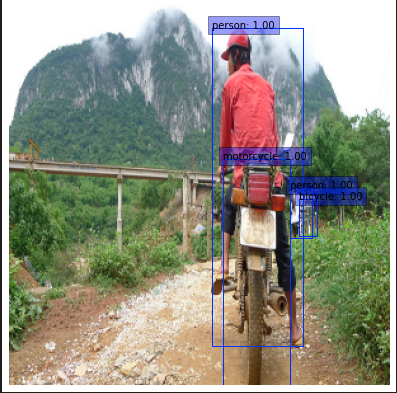

# tf_detectors

This repository contains popular object detection algorithms written by tensorflow 2.

Note. This repository do not guarantee the performances of detection algorithms in real world applications, Since this project is at the inital step.
Therefore, The hyperparameters, training methods and model architectures must be optimized for your problem.


## Tutorial

How to use this repository? First of all, See tutorial.ipynb

You can create a Dataset object from given paths of images and coco-style-json. You choose how much images are used in dataset and whether you shuffle them or not. The datasets also takes 'transform' and 'target_transform' which should be used for image transformation(image augmentation) and label transformation(bbox refinery by image augmentation) respectively.

We create only one dataset for this tutorial. For real, We need at least two datasets for training and validation. 
```
dataset_path = /your/dataset/directory/path
image_path = f"{dataset_path}/images/train/"
annotation_path = f"{dataset_path}/annotations/train.json"
train_dataset = SSDDataset(image_path, annotation_path, num_examples=50, shuffle=False, transform=None, target_transform=None)
```

get_item method bring a item with image id of the dataset. You can visualize the item.
```
from utils.visualize import visualize_detections

image, boxes, labels = train_dataset.get_item(train_dataset.image_ids[0])
classes = [train_dataset.labels[int(label)] for label in labels]
visualize_detections(image, boxes, classes, tf.ones_like(labels))
```


Load your model.
```
num_classes = train_dataset.num_classes()
model = SSD300(num_classes)
```


The method, load_tfds creates tf.data.Dataset object for the dataset. This data pipeline batches the data items which converted into the form your model can learn with supervised manners.

```
train_tfds = train_dataset.load_tfds(batch_size=1, model=model)
items = next(iter(train_tfds))
for item in items:
    print(item.shape)

#results are printed.
#(1, 300, 300, 3).
#(1, 8732, 5). 5 => (dx,dy,dw,dh,c)
```

You can train the model with keras fit method.
```
optimizer = tf.optimizers.Adam(learning_rate=0.001)
model.compile(optimizer=optimizer)
model.fit(train_tfds, epochs=5, verbose=1,)
```

model.inference returns keras model for model inference. 
```
inference_model = model.inference(confidence_threshold=0.3)
detections = inference_model(images)
```
The detections can be visualized directly with visualize_inference.

```
from utils.visualize import visualize_inference
visualize_inference(images[0], train_dataset.labels, detections)
```


## 2. training method.

There are some executable modules which bring dataset and models to train. You can reference this modules for your experiments.

- train_COCO_EfficientSSD.py
- train_COCO_RetinaNet.p
- train_COCO_SSD.py
## 3. performance evaluation

This repository do not yet offer mAP evaluation which are the most popular metric in object detection algorithms. I recommend you to use [Padilla's open sources](https://github.com/rafaelpadilla/Object-Detection-Metrics). My use case is [here](https://drive.google.com/drive/folders/1kEweEiyCWdWPoPyWMuL9_rxiz2YdG5nK?usp=sharing)  

Quickstart to create coco-style json file for your detections is [here](https://colab.research.google.com/drive/1hfqa82J-VLZk2AVJie74mhy7pY_kT84_?usp=sharing) 


## 4. Reference

This repository is highly inspired and referenced with other open source projects written below.

- https://github.com/ChunML/ssd-tf2
- https://keras.io/examples/vision/retinanet/
- https://github.com/fizyr/keras-retinane
- https://github.com/rafaelpadilla/Object-Detection-Metrics

You may need to see other topics for object detection.

1. anchor box optimization
2. image augmentation for object detection
3. backbone optimization for your problem. e.g Do the mobilenet backbone makes your detector faster?
4. More powerful detectors such as YOLO v5, EfficientDet
5. Impacts of image resolution on detector's performance.

 
